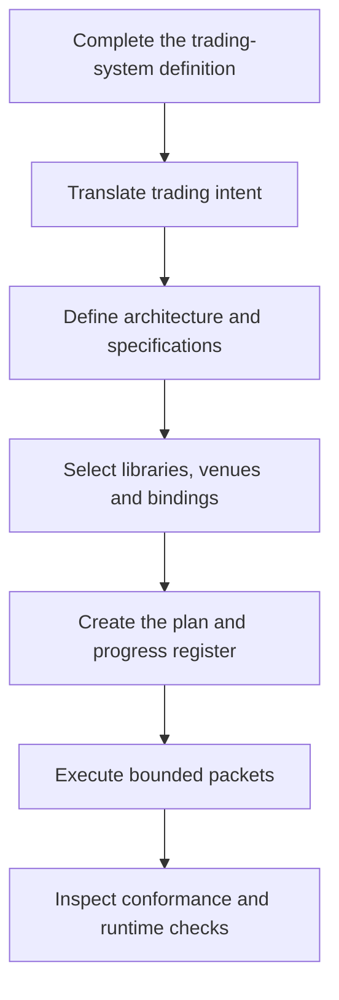

<div align="center">

# Options OS

[](https://www.leanos.tech/pricing)
[](https://www.leanos.tech/docs)
[](https://www.leanos.tech/docs)
[](https://www.leanos.tech/docs)
[](#venue-reference)
[](https://github.com/LeanOS-Technologies/options-os-public/commits/main)

**A spec-driven framework for building crypto-options trading engines with Claude Code or Codex.**

Start from a trading-system definition. Move through architecture, buildable specifications, implementation planning, bounded execution and conformance checks inside one repository.

[Website](https://www.leanos.tech/) · [Docs](https://www.leanos.tech/docs) · [Pricing](https://www.leanos.tech/pricing) · [What you receive](#what-you-receive) · [Build path](#build-path) · [Product boundary](#product-boundary)

</div>

---

## Build a crypto-options trading engine without starting from an empty repository

Coding agents can generate code. They cannot infer the correct options semantics, state ownership, venue boundaries, failure behaviour or completion criteria from a short prompt.

Options OS supplies the engineering framework before strategy-specific implementation begins.

```text
trading-system definition
→ engineering intent
→ architecture and buildable specifications
→ libraries, assemblies and venue bindings
→ implementation plan and progress register
→ bounded execution packets
→ implementation with Claude Code or Codex
→ invariant and conformance checks
```

You define the strategy and trading decisions. Options OS supplies the reusable system underneath them.

## What you receive

| Area | Included |
| --- | --- |
| Crypto-options model | Domain profile, canonical vocabulary, typed contracts, units, identities and reusable laws |
| Quantitative foundations | Pricing, volatility, portfolio, cost and hedging capabilities |
| Trading infrastructure | Messaging, runtime contracts, reconciliation boundaries and operational foundations |
| Venue architecture | Reusable venue contracts and an implemented Deribit reference adapter |
| Specification system | Trading-system intake, architecture, component, library, venue, engine, assembly, operations and scenario specifications |
| Agentic build layer | Governed architecture, specification, planning, implementation, venue and verification capabilities for Claude Code and Codex |
| Execution control | Implementation plans, one progress register, bounded execution packets and completion rules |
| Verification | Invariants, tests, static checks, runtime checks, implementation mapping and conformance review |

The complete implementation is delivered through a private GitHub repository after purchase.

## Build path



The repository guides the work from the supplied `form.md` through engineering intent, architecture, specifications, planning, implementation and verification. Buyers do not need to design an agent-control system before they can build the trading engine.

## Built for coding agents

Options OS gives Claude Code and Codex repository-level context and bounded capabilities for:

- translating trading intent into engineering contracts;
- defining system architecture and ownership boundaries;
- writing buildable specifications;
- planning dependency-ordered implementation;
- executing one controlled implementation boundary at a time;
- integrating venues against a reusable adapter contract;
- checking quantitative units, persistence, trading state and implementation conformance;
- evaluating runtime and release readiness.

The internal procedures, routing logic, enforcement rules and agent instructions remain part of the private product.

## Venue reference

Deribit is the implemented reference adapter.

It demonstrates how the reusable venue contract handles options instruments, market and account observations, execution outcomes and reconciliation. Other venues remain implementation targets until they meet the same contract and verification standard.

## One framework. Any crypto-options strategy.

Options OS does not limit the engine to a predefined strategy. Possible directions include:

| Engine idea | Strategy-specific work you supply |
| --- | --- |
| Volatility relative value | Opportunity definition, structure selection, entry, exit and risk policy |
| Skew or smile trading | Signal construction, wing selection, sizing, hedging and lifecycle rules |
| Calendar or term-structure trading | Expiry selection, carry logic, roll policy and risk limits |
| Market making | Quoting policy, inventory targets, spread logic and adverse-selection controls |
| Portfolio hedging | Mandate, exposure targets, hedge triggers, urgency and execution policy |
| Lifecycle engine | Entry, defend, devega, rebalance, exit and safe-flat decisions |

These are examples, not included strategies and not limits on the framework.

## Product boundary

| Options OS provides | You define and operate |
| --- | --- |
| Crypto-options domain semantics | Trading thesis and PnL mechanism |
| Reusable quantitative and trading foundations | Strategy decisions and portfolio intent |
| Venue contracts and Deribit reference | Venue selection and additional integrations |
| Engine, runtime and assembly contracts | Mandates, risk policy and lifecycle rules |
| Claude Code and Codex build controls | Review and approval of generated work |
| Verification and conformance machinery | Credentials, capital, deployment, monitoring and live approval |

Options OS is not a trading bot, alpha source, signal service, hosted execution platform or guarantee of trading performance.

## Access

Options OS is available for **$499 as a one-time purchase**. The standard commercial licence covers one legal entity and unlimited internal deployments. There is no subscription.

[View pricing and access](https://www.leanos.tech/pricing)

Custom implementation is available when you want LeanOS to build a defined engine, venue integration or wider trading platform.

## Security and proprietary material

Do not publish credentials, private repository content, customer information or proprietary implementation details in public issues.

Report product vulnerabilities privately to **bella@leanos.tech**. See [SECURITY.md](SECURITY.md).

Options OS is proprietary software. Public access to this repository does not grant a licence to the private source, specifications, agent procedures, workflow logic or associated product assets. See [NOTICE.md](NOTICE.md).

---

<div align="center">

**Define the trading system. Let the repository control how it is built and what counts as done.**

</div>
