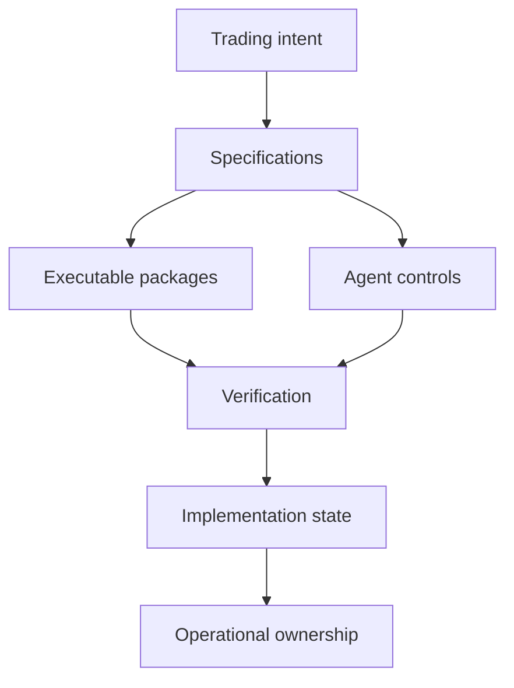

# OptionsOS

**A private, AI-native operating repository for building owned crypto-options systems.**

OptionsOS pairs executable domain, quant, trading, infrastructure, and venue packages with matching specifications, agent controls, implementation state, and verification tooling.

Start from an implemented operating foundation. Add the PnL mechanism, venue decisions, configuration, deployment, and operational controls that make the system yours.

[Inspect OptionsOS](https://www.leanos.tech/products/options-os) · [Build with LeanOS](https://www.leanos.tech/services) · [Book a call](https://cal.com/bellabe/options-os)

> [!IMPORTANT]
> This repository is the public technical evidence surface for OptionsOS.  
> The complete source repository is private and is delivered through a GitHub invitation after purchase.

## What OptionsOS is

OptionsOS is an implemented operating foundation for engineers building crypto-options engines and trading platforms.

It connects:

- Executable packages
- Mirrored system and component specifications
- Implementation plans, decisions, and readiness state
- Claude Code and Codex controls
- Invariants, linting, probes, and verification workflows
- Runtime, recovery, deployment, and operational knowledge

The repository is designed so the software, its architectural intent, and the controls used to extend it reinforce the same system boundaries.

OptionsOS is not a hosted platform or a black-box trading product. Buyers receive a private repository that they inspect, modify, deploy, and operate inside infrastructure they control.

## Why it exists

A trading idea does not become a trading system by adding more code.

Before a strategy can operate, pricing, volatility, market data, positions, execution, venue integration, risk, runtime, reconciliation, and recovery must agree on the same contracts and state.

When those decisions remain implicit:

- Local implementation choices become accidental architecture.
- Reusable domain laws fragment across engines and venues.
- Several components begin to own the same state.
- Venue-specific behavior leaks into the wider system.
- Runtime and failure behavior arrive after implementation.
- AI coding agents fill architectural gaps with plausible but inconsistent decisions.

OptionsOS moves that work into an explicit operating repository before strategy-specific implementation expands the system.

## The operating-repository model

An operating repository is part executable system, part system memory.

It preserves not only what was built, but the decisions required to understand, extend, verify, deploy, and operate it.



The model is based on three rules:

### Define

Intent precedes implementation.

PnL mechanisms, system boundaries, contracts, invariants, state ownership, constraints, and failure behavior are made explicit before they fragment across the codebase.

### Constrain

Engineers and coding agents build inside the same system.

Specifications, implementation order, scoped workflows, acceptance conditions, and verification gates reduce local improvisation and preserve coherence as the repository grows.

### Own

The repository remains a compounding asset.

Source, architecture, operating knowledge, deployment, and future extension remain under the builder's control instead of becoming a permanent platform dependency.

## What is implemented

OptionsOS contains six connected foundations.

| Foundation | What it provides | Disclosed modules |
| --- | --- | --- |
| Domain | Typed domain objects and reusable deterministic trading laws | `canonical` |
| Quant | Pricing, volatility surfaces, portfolio exposure, trading costs, hedging, and risk | `quant-pricing`, `quant-surface`, `quant-portfolio`, `quant-cost`, `hedging`, `risk-kernel` |
| Trading | Orders and shared operating infrastructure | `order-algebra`, `messaging`, `config`, `logger`, `notification` |
| Venue | Reusable adapter contracts with a concrete venue implementation | `adapter-core`, `adapter-deribit` |
| Specification | Assemblies, components, libraries, strategies, venues, directives, grammar, and system contracts | `specs/assemblies`, `specs/components`, `specs/directive`, `specs/grammar`, `specs/system` |
| AI engineering | Controlled Claude Code and Codex execution, implementation state, invariants, linting, probes, and scripts | `.agents`, `.claude`, `.codex`, `execution`, `tools`, `AGENTS.md`, `CLAUDE.md`, `INVARIANTS.md` |

## Disclosed repository boundary

The following tree reflects actual OptionsOS boundaries. The implementation remains private.

```text
options-system-os/
├── .agents/
├── .claude/
├── .codex/
├── execution/
├── packages/
│   ├── adapter-deribit/
│   └── libs/
├── specs/
│   ├── assemblies/
│   ├── components/
│   ├── directive/
│   ├── grammar/
│   └── system/
├── tools/
├── AGENTS.md
├── CLAUDE.md
└── INVARIANTS.md
```

### Agent workspaces

`.agents/`, `.claude/`, and `.codex/` contain agent-specific commands, skills, hooks, constraints, and workflows.

### Implementation state

`execution/` preserves implementation plans, decisions, current state, readiness evidence, and delivery records.

### Venue reference

`packages/adapter-deribit/` contains an implemented Deribit adapter and serves as the concrete reference for the reusable venue-adapter contract.

### Executable foundations

`packages/libs/` contains canonical, quant, risk, hedging, order, messaging, configuration, logging, notification, and related operating libraries.

### Mirrored specifications

`specs/` preserves system composition, component behavior, repository directives, specification grammar, and system-wide contracts beside the executable packages.

### Verification tooling

`tools/` contains documentation, linting, probes, and scripts used to inspect and verify the repository.

### Root execution contracts

`AGENTS.md`, `CLAUDE.md`, and `INVARIANTS.md` define repository-wide execution rules and system laws.

## How the artifacts remain connected

OptionsOS does not treat documentation as an independent description of the code.

The operating model links the major artifact classes:

```text
Trading definition
    ↓
System and assembly specifications
    ↓
Component and package specifications
    ↓
Implementation plan and agent scope
    ↓
Executable packages
    ↓
Tests, probes, invariants, and readiness gates
    ↓
Implementation and operational state
```

This relationship is the core of the product. Code can change without losing the system decisions that explain what it must do and how it fits into the larger repository.

## Public evidence

This public repository does not reproduce the private product. It exposes generated and reviewed evidence about the private release.

The evidence surface is designed to include:

```text
evidence/
├── current-release.json
├── disclosed-tree.txt
├── package-inventory.json
├── specification-inventory.json
├── agent-workspace-inventory.json
├── verification-summary.json
├── claim-evidence-map.json
└── private-release.sha256
```

### Release identity

`current-release.json` identifies the private OptionsOS release represented by the public evidence.

### Package inventory

`package-inventory.json` records the disclosed executable foundations and their public responsibilities.

### Specification inventory

`specification-inventory.json` records the disclosed specification categories and the system boundaries they mirror.

### Agent-workspace inventory

`agent-workspace-inventory.json` records the existence and role of the Claude Code, Codex, and shared agent controls without publishing private instructions.

### Verification summary

`verification-summary.json` records the verification categories applied to the represented release, including tests, linting, invariants, probes, and readiness checks.

### Claim-to-evidence mapping

`claim-evidence-map.json` maps public product claims to their supporting evidence and verification level.

### Private release attestation

`private-release.sha256` contains the public root hash of a deterministic private release manifest.

The full manifest remains inside the buyer repository. A buyer can use it to confirm that the received private release corresponds to the publicly attested release.

## Evidence principles

Public evidence follows these rules:

1. Evidence is generated from the private repository release.
2. Public paths and claims are restricted to an explicit disclosure allowlist.
3. Secrets, credentials, local state, caches, generated noise, and Git metadata are excluded.
4. Paths and files are normalized and deterministically ordered before hashing.
5. The public release never exposes proprietary source or private specifications.
6. Every public claim identifies its supporting evidence.
7. Buyers can verify the attestation against the private repository they receive.

## Public claim boundary

The public repository is intended to support these product claims:

| Claim | Public evidence | Buyer verification |
| --- | --- | --- |
| OptionsOS contains executable domain, quant, trading, infrastructure, and adapter packages | Package inventory and foundation documentation | Private path and manifest verification |
| OptionsOS includes an implemented Deribit adapter | Venue documentation and disclosed package inventory | Private package verification |
| System and component specifications mirror executable boundaries | Specification inventory and architecture documentation | Private specification mapping |
| Claude Code and Codex operate through repository controls | Agent-workspace inventory and execution-model documentation | Private workspace verification |
| The repository contains implementation state and readiness evidence | Disclosed tree and implementation-control documentation | Private execution-state verification |
| Verification includes tests, linting, invariants, probes, and readiness checks | Verification summary | Private verification workflow |

The public repository does not claim that visitors can independently reproduce or execute the private product.

## What OptionsOS removes

OptionsOS reduces the work required before strategy-specific engineering can begin:

- Inventing the options-domain model
- Rebuilding pricing, volatility, portfolio, cost, hedging, and risk foundations
- Defining order, messaging, configuration, logging, and notification boundaries
- Designing an adapter contract without a working venue reference
- Separating executable packages from their architectural specifications
- Creating the specification hierarchy and repository directives
- Teaching every coding agent the repository architecture from scratch
- Adding invariants, probes, implementation records, and readiness evidence after the system has already grown

It does not remove the engineering responsibility required to build and operate a real trading system.

## What remains yours

The buyer remains responsible for:

- Defining the PnL mechanism
- Implementing strategy-specific decisions
- Selecting and configuring venues
- Supplying credentials and infrastructure
- Configuring deployment and monitoring
- Validating strategy and system behavior
- Reviewing risk and operational readiness
- Approving any live deployment
- Operating the resulting system

OptionsOS provides the implemented operating foundation. It does not make trading decisions or approve a system for live use.

## What OptionsOS is not

OptionsOS is not:

- A trading bot
- A profitable strategy
- An alpha feed
- A signal service
- A hosted execution platform
- A managed trading service
- A substitute for engineering validation
- A guarantee of trading performance

## From purchase to implementation

```text
01  Receive private access
02  Read the system before changing it
03  Define the PnL mechanism
04  Implement inside existing boundaries
05  Verify and operate
```

### 1. Receive private access

Enter your GitHub username during checkout. The repository invitation follows payment confirmation.

### 2. Read the system before changing it

Start with the technical specification, architecture, invariants, agent contracts, and component specifications.

### 3. Define the PnL mechanism

Specify the opportunity, construction, entry, exit, hedging, cost, risk, and lifecycle decisions that make the engine distinct.

### 4. Implement inside existing boundaries

Extend the engine, libraries, strategies, and venue packages without collapsing reusable, strategy-specific, and venue-specific logic together.

### 5. Verify and operate

Run the repository checks, probes, implementation records, and readiness gates before deploying to infrastructure you control.

## Product fit

OptionsOS is a good fit when:

- You work with Python, Git, and system specifications.
- You are building an options engine or wider trading platform.
- You want implemented foundations without losing architectural control.
- You need explicit strategy, execution, risk, venue, and runtime boundaries.
- You use Claude Code, Codex, or an engineering team to extend the system.
- You intend to own the implementation, deployment, and operation.

OptionsOS is not the right product when you want:

- A one-click trading bot
- A strategy supplied with the purchase
- Trading signals or an alpha feed
- A hosted or managed execution service
- A system requiring no engineering, testing, deployment, or operational work

## OptionsOS or LeanOS Services

The difference is who owns the implementation responsibility.

| Route | Choose it when | Responsibility |
| --- | --- | --- |
| OptionsOS | Your team will define the strategy, extend the repository, integrate the required venues, and operate the system | You own implementation |
| LeanOS Services | You need a strategy engine, venue integration, critical subsystem, or complete platform delivered | LeanOS owns the defined engineering outcome and transfers the capability |

[Inspect OptionsOS](https://www.leanos.tech/products/options-os) · [View LeanOS Services](https://www.leanos.tech/services)

## Access and pricing

OptionsOS is available as a one-time purchase for **$499**.

The purchase includes access to the complete private repository. There is no subscription.

Checkout collects the GitHub username used for the private repository invitation.

[Buy OptionsOS | $499](https://www.leanos.tech/products/options-os)

## Frequently asked questions

### Is OptionsOS a trading bot?

No. It is an implemented operating foundation for building an owned crypto-options system.

### Does it include a profitable strategy?

No. It includes the architecture, libraries, specifications, and engine boundaries required to implement strategy-specific PnL mechanisms. It is not sold as an alpha source or performance promise.

### What is already implemented?

The private repository contains executable domain, quant, trading, infrastructure, and adapter packages; an implemented Deribit adapter; a mirrored specification hierarchy; AI-agent controls; implementation state; and verification tooling.

### Is the complete repository public?

No. This repository exposes the technical model, disclosed boundaries, and release evidence. Buyers receive the complete source through a private GitHub invitation.

### Is it ready to trade live immediately?

No. Strategy logic, venue credentials, configuration, validation, testing, deployment, monitoring, and operational review remain required.

### What technical knowledge is required?

OptionsOS is intended for people comfortable with Python, Git, software architecture, and trading-system concepts, or teams with an engineer who is.

### What if I need LeanOS to implement the system?

Use [LeanOS Services](https://www.leanos.tech/services) when you need engineering ownership of a strategy engine, venue integration, critical system capability, or complete trading platform.

## Security

Do not report vulnerabilities in the private OptionsOS product through a public GitHub issue.

Follow the instructions in [`SECURITY.md`](SECURITY.md) for responsible private disclosure.

Do not include credentials, private repository content, customer information, or proprietary implementation details in public issues.

## Proprietary product notice

The documentation and evidence in this repository are publicly viewable.

OptionsOS is proprietary software. Public access to this repository does not grant a license to the private source code, specifications, agent workflows, implementation records, or other proprietary assets delivered with OptionsOS.

See [`NOTICE.md`](NOTICE.md) for the complete public/private boundary.

## Links

- [OptionsOS](https://www.leanos.tech/products/options-os)
- [LeanOS Services](https://www.leanos.tech/services)
- [About LeanOS](https://www.leanos.tech/about)
- [Book a call](https://cal.com/bellabe/options-os)

---

**Define the system. Constrain the build. Preserve ownership.**