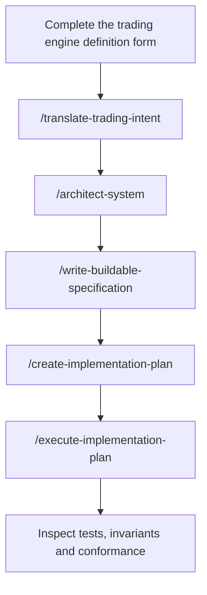

<div align="center">

# Options OS

[](https://www.leanos.tech/pricing)
[](https://www.leanos.tech/docs)
[](https://www.leanos.tech/docs)
[](https://www.leanos.tech/docs)
[](#venue-reference)
[](https://github.com/LeanOS-Technologies/options-os-public/commits/main)

**An AI-native framework for building crypto-options trading engines with Claude Code or Codex.**

Start from a trading engine definition. Move through specifications, architecture, implementation planning, bounded execution and verification inside one repository.

[Website](https://www.leanos.tech/) · [Docs](https://www.leanos.tech/docs) · [Pricing](https://www.leanos.tech/pricing) · [Engines](https://www.leanos.tech/engines) · [What you receive](#what-you-receive) · [Build path](#build-path) · [Product boundary](#product-boundary)

</div>

---

## Build a crypto-options trading engine without starting from an empty repository

Coding agents can generate code. They cannot infer the correct options semantics, state ownership, venue boundaries, failure behaviour or completion criteria from a short prompt.

> Sell an ETH strangle when implied volatility is high. Keep the position delta-neutral and exit at 50% profit.

What counts as high volatility? Which expiry and strikes? How is the position sized? What happens after a partial fill? When does it hedge? How are costs, settlement, failures and restarts handled? Every missing decision gives the agent room to invent financial meaning.

Options OS supplies the definitions, specifications, reusable code and repository controls that resolve those decisions before strategy-specific implementation begins.

```text
trading idea
→ trading engine definition form
→ engine, operations and scenario specifications
→ architecture, libraries and venue bindings
→ implementation-ready specifications
→ dependency-closed implementation plan
→ bounded execution packets with Claude Code or Codex
→ tests, invariant checks and conformance evidence
```

You define the strategy and trading decisions. Options OS supplies the reusable system underneath them.

## What you receive

| Area | Included |
| --- | --- |
| Engine definition | Trading engine definition form plus engine, operations and scenario specification templates |
| Crypto-options model | Canonical vocabulary, instruments, units, typed contracts and shared trading semantics |
| Quantitative foundations | Volatility, pricing, Greeks, surfaces, portfolio exposure, costs, PnL, risk and hedging |
| Trading infrastructure | Trading model, message bus, orders, price facts, market quality, configuration, logging and notifications |
| Venue architecture | `adapter-core` venue contract and an implemented Deribit reference adapter |
| Reusable libraries | 21 Python libraries, each with its own specification, tests and code map |
| Agentic build layer | 30 skills, 5 end-to-end workflows, hooks and tools for Claude Code and Codex |
| Execution control | Implementation plans, bounded execution packets and completion rules |
| Verification | Invariants, Ruff, Mypy, package test suites, architecture enforcement, venue probes and conformance review |

The complete implementation is delivered through a private GitHub repository. After payment, the GitHub account entered at checkout is invited as a read-only collaborator.

## Build path



Complete the trading engine definition form with a capable web-based reasoning model, add it to the repository, then run the skills in order. In Codex, replace the leading `/` with `$`.

The form is complete only when two independent engineers could not implement different behaviour from it. Implementation begins only after the engine, operations and scenario specifications are reviewed and accepted.

## Built for coding agents

Options OS gives Claude Code and Codex repository-level context and bounded capabilities for:

- translating trading intent into engineering specifications;
- defining system architecture, assembly and ownership boundaries;
- writing buildable specifications;
- planning dependency-ordered implementation;
- executing one controlled implementation packet at a time;
- composing existing libraries and venue integrations;
- designing and verifying unit and end-to-end tests;
- checking financial units, calculations and implementation conformance;
- tracing and repairing defects;
- evaluating runtime evidence and release readiness.

Hooks block destructive repository changes, weakened tests, suppressed failures, unauthorized changes to semantic authority and incomplete work reported as complete.

The internal procedures, routing logic, enforcement rules and agent instructions remain part of the private product.

## Venue reference

Deribit is the implemented reference adapter.

It demonstrates how the reusable `adapter-core` contract handles instruments, market data, account state, orders, fills, positions, errors, rate limits, persistence and reconciliation. Engine code consumes canonical facts and commands and never depends on Deribit payloads. Other venues remain implementation targets until they meet the same contract and verification standard.

## One framework. Any crypto-options strategy.

Options OS does not limit the engine to a predefined strategy. Possible directions include:

| Engine idea | Strategy-specific work you supply |
| --- | --- |
| Volatility relative value | Opportunity definition, structure selection, entry, exit and risk policy |
| Skew or smile trading | Signal construction, wing selection, sizing, hedging and lifecycle rules |
| Calendar or term-structure trading | Expiry selection, carry logic, roll policy and risk limits |
| Market making | Quoting policy, inventory targets, spread logic and adverse-selection controls |
| Portfolio hedging | Mandate, exposure targets, hedge triggers, urgency and execution policy |
| Lifecycle engine | Entry, defend, devega, rebalance, exit and safe-flat decisions |

These are examples, not included strategies and not limits on the framework.

Engines built with Options OS can be published by their authors in the public [engine directory](https://www.leanos.tech/engines). Metrics and claims on engine pages are author supplied and not verified by LeanOS.

## Product boundary

| Options OS provides | You define and operate |
| --- | --- |
| Crypto-options domain semantics | Trading thesis, signals and PnL mechanism |
| Trading engine definition form and specification templates | Strategy decisions and portfolio intent |
| Reusable quantitative and trading libraries | Mandates, risk limits and lifecycle policy |
| Venue contract and Deribit reference adapter | Venue selection and additional integrations |
| Claude Code and Codex skills, workflows, hooks and tools | Review and approval of generated work |
| Verification and conformance machinery | Credentials, capital, hosting, deployment, monitoring and live approval |

Options OS is not a trading bot, profitable strategy, signal service, hosted execution platform or guarantee of trading performance. Every engine requires configuration, testing, shadow or paper validation, deployment, monitoring and explicit live approval.

## Access

Options OS is available for **$149 as a one-time purchase**. There is no subscription. Repository access is granted on purchase and refunds are not offered.

Python and software-engineering knowledge help but are not required: Claude Code or Codex performs the repository work. You must be able to define the strategy and evaluate its trading and operating decisions.

[View pricing and access](https://www.leanos.tech/pricing)

Custom implementation is available when you want LeanOS to build the trading engine and agentic layer your strategy and operations require. Scope and price are agreed before work begins. [Book a call](https://cal.com/bellabe/options-os).

## Security and proprietary material

Do not publish credentials, private repository content, customer information or proprietary implementation details in public issues.

Report product vulnerabilities privately to **bella@leanos.tech**. See [SECURITY.md](SECURITY.md).

Options OS is proprietary software of LeanOS Technologies FZE LLC. Public access to this repository does not grant a licence to the private source, specifications, agent procedures, workflow logic or associated product assets. See [NOTICE.md](NOTICE.md).

Options trading is high risk. You remain responsible for your own decisions.

---

<div align="center">

**Define the trading engine. Let the repository control how it is built and what counts as done.**

</div>
